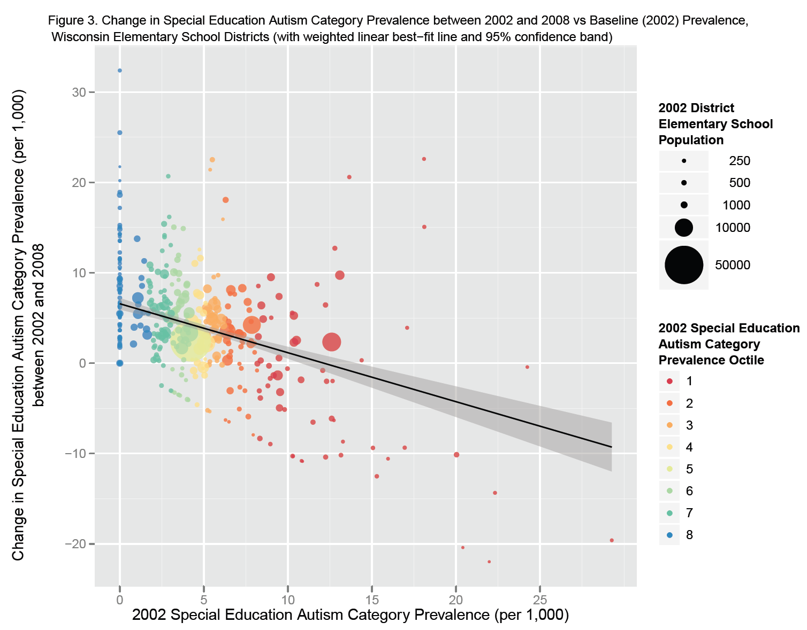
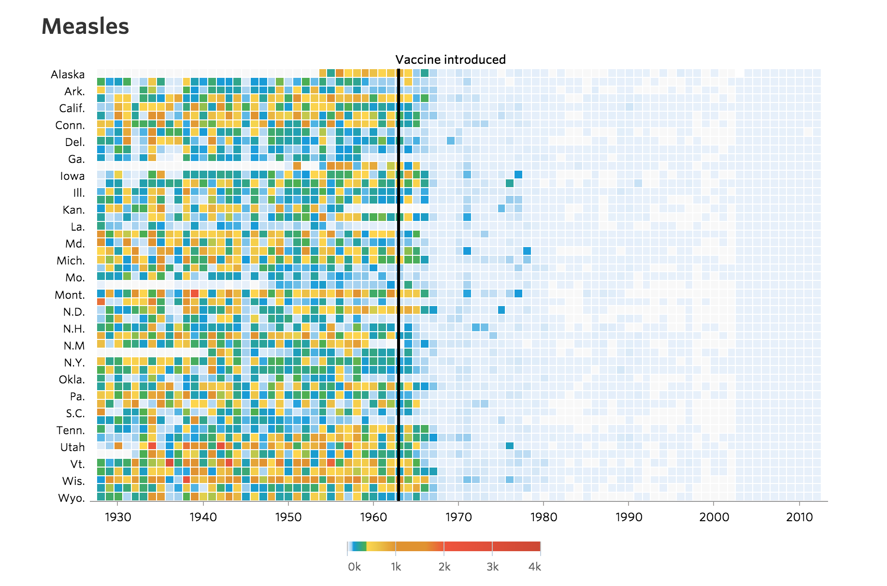
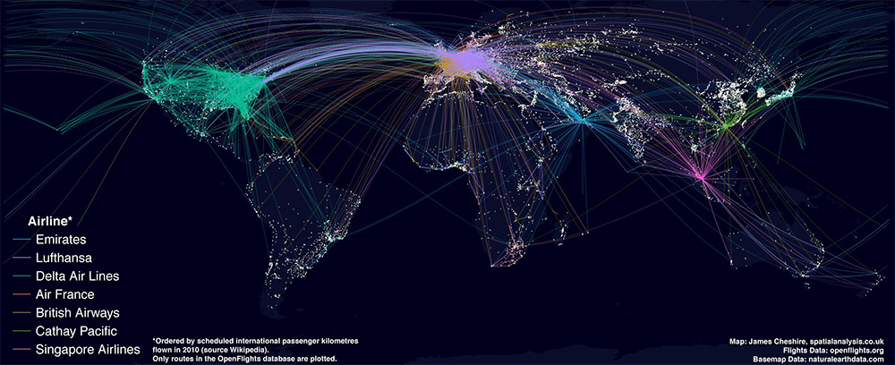

## A bit about R

- GNU Free
- Data analysis and superior visualisation 
- Burgeoning R community - 6,912 packages as of July 2015 on [CRAN] (https://cran.r-project.org/web/views/)
- [Integration of R in SQL Server 2016] (http://blog.revolutionanalytics.com/2015/05/r-in-sql-server.html)
- [#6 in IEEE 2015 Top Programming Languages] (http://spectrum.ieee.org/computing/software/the-2015-top-ten-programming-languages)


--- bg:url(assets/img/fundamentals2.jpg) #sectionBreak
## The Fundamentals


--- &twocol
## Data Types

*** =left

- Abstraction
- Think [Scales of measurement in Statistics] (http://www.sciencemag.org/content/103/2684/677.extract)
- Most common types:
	- Numeric (decimal numbers, increased precision)
	- Integer (simple numbers)
	- Logical (Boolean True and False values)
	- Character (Textual data)

*** =right

```{r, echo = TRUE}
myNumeric <- 10.5
class(myNumeric)
myNumeric <- 10
class(myNumeric)
myInteger <- as.integer(10.5)
class(myInteger)
12 > myNumeric
class(12 > myNumeric)
myCharacter <- 'This is my character'
myCharacter
class(myCharacter)
```


--- &twocol
## Data Structures

*** =left

- Vectors
- Matrices and Arrays
- Dataframes
- Lists

*** =right

```{r, echo = TRUE}
myVector <- c(1, 2, 3, 4)
myVector

myMatrix <- matrix(c(1, 2, 3, 4), ncol = 2)
myMatrix
```


---
## Data Structures

*** =left

- Vectors
- Matrices and Arrays
- Dataframes
- Lists

*** =right

```{r, echo = TRUE}
myDf <- data.frame(col1 = c(1, 2, 3, 4), col2 = c('a', 'b', 'c', 'd'))
myDf

myList <- list(l1 = c(1, 2, 3, 4), l2 = c('a', 'b', 'c', 'd'))
myList
```


---
## Data Structures

Dimensionality | Homogeneous | Heterogeneous
---------------|-------------|--------------
1		   | Atomic Vector | List
2		   | Matrix		| Dataframe
n		   | Array		|		


---
## Control Structures in R

### Conditional Functions

- If Else
- Ifelse
- Arithmetic and Boolean Operators

### Loop Functions

- for Loop
- while Loop
- repeat Loop


---
## Functions

<blockquote><p>Everything in R is an object.</p>
<p>Every process in R occurs as a result of a function call.</p>
<p><small>John Chambers (Developer of S Programming Language)</small></p></blockquote>

- Functional Programming
- Modularity
- Automation


--- &twocol
## Functions

*** =left
- Function Structure
	- Arguments/Formals
	- Body
	- Environment

*** =right
```{r, echo = TRUE}
sampleFunction <- function(numbers){
roundedUp <- ceiling(numbers)
roundedDown <- floor(numbers)
signf <- signif(numbers, 3)
df <- data.frame(number = numbers, 
		roundedUp = roundedUp, 
		roundedDown = roundedDown, 
		significantNo = signf)
return(df)
}
```


---
## Importing and Exporting Data

- Multiple formats can be imported: CSV; TXT; JSON; Excel; SAS; SPSS; RData
- Scripting or GUI
- Packages or Base R


--- bg:url(assets/img/intermediary4.jpg) #sectionBreak
## Analysing and producing Results


---
## Basic Data Analysis

>- Filtering/Subsetting
>- Selecting Columns
>- Merging/Joining data sets
>- Apply family of R functions
>- dplyr and tidyr (or reshape2)


---
## Basic Data Analysis

### Apply family of R Functions

>- Iteratively process data in various data structures
>- Iteratively process grouped data
>- apply(), lapply(), sapply(), mapply(), tapply(), and others

- https://nsaunders.wordpress.com/2010/08/20/a-brief-introduction-to-apply-in-r/

### dplyr

>- Efficient code, simplified syntax
>- Variety of manipulation techniques
>- In-memory database support and external database support
	- In-memory database: SQLite
	- External database: PostgreSQL, MySQL, Bigquery
<p class="text-warning"><small>Caveat: Only Dataframes supported</small></p>


--- &twocol
## Basic Data Analysis

### Tidying or Reshaping data

*** =left

- Wide format

City | Population | Rainfall (mm/year) | 
-----|------------|--------------------|
Riyadh | 100,000,000 | 10 |
Dubai | 10,000,000 | 20 |
London | 20,000,000 | 100 |


*** =right

- Long format

City | Variable | Value |
-----|----------|-------|
Riyadh | Population | 100,000,000 |
Riyadh | Rainfall | 10 |
Dubai | Population | 10,000,000 |
Dubai | Rainfall | 20 |
London | Population | 20,000,000 |
London | Rainfall | 100 |


---
## Merging Data sets

- Using base R to join data sets: merge(), rbind(), cbind()
- Using packages to join data sets: dplyr


--- bg:url(assets/img/penultimate1.jpg) #sectionBreak
## Visualisation


---
## Graphics in R

<div id="myCarousel" class="carousel slide" data-ride="carousel">
  <!-- Indicators -->
  <ol class="carousel-indicators">
    <li data-target="#myCarousel" data-slide-to="0" class="active"></li>
    <li data-target="#myCarousel" data-slide-to="1"></li>
    <li data-target="#myCarousel" data-slide-to="2"></li>
    <li data-target="#myCarousel" data-slide-to="3"></li>
  </ol>

  <!-- Wrapper for slides -->
  <div class="carousel-inner" role="listbox">
    <div class="item active">
      
    </div>

    <div class="item">
      
    </div>

    <div class="item">
      
    </div>
  </div>

  <!-- Left and right controls -->
  <a class="left carousel-control" href="#myCarousel" role="button" data-slide="prev">
    <span class="glyphicon glyphicon-chevron-left" aria-hidden="true"></span>
    <span class="sr-only"><</span>
  </a>
  <a class="right carousel-control" href="#myCarousel" role="button" data-slide="next">
    <span class="glyphicon glyphicon-chevron-right" aria-hidden="true"></span>
    <span class="sr-only">></span>
  </a>
</div>


---
## Plotting various charts

>- Basic Charts
	- Bar Charts
	- Line Charts
	- Area Charts
	- etc.

>- Statistical Charts
	- Tukey's Boxplots
	- Scatterplots
	- Bubble Charts
	- etc.

>- Exotic Charts
	- Streamgraphs
	- Wordclouds
	- Heatmaps
	- etc.


---
## Ggplot2

- Grammar of Graphics


--- bg:url(assets/img/final1.jpg) #sectionBreak
## Reproducible Research


---
## knitr

>- Literate Programming
>- Combine visualisations with explanatory text
>- Output: HTML/Web, PDF, and Word documents


---
## Writing a basic report


---
## Writing a complex report


---
## Final exercise


---
## References

